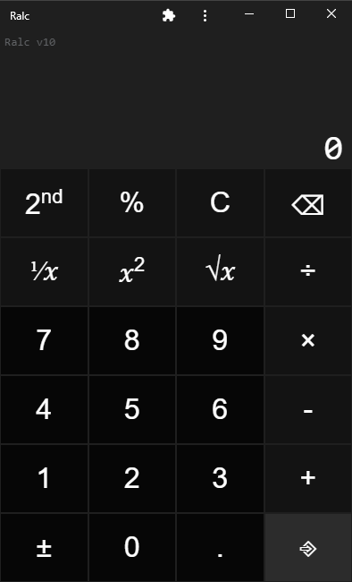

<br>

<p>
  Ralc uses <a href="https://facebook.github.io/react/">React</a>, <a href="https://webpack.js.org/">Webpack</a> and <a href="https://www.npmjs.com/package/react-refresh">React Fast Refresh</a>.
</p>

<br>

<div align="center">

[![Build Status][github-actions-status]][github-actions-url]

</div>

## Install

Clone the repo and install dependencies:

```bash
git clone https://github.com/Shamus03/ralc.git
cd ralc
npm install
```

## Starting Development

Start the app in the `dev` environment:

```bash
npm start
```

## Building for Production

To build the app:

```bash
npm run build
```

## License

MIT © [Shamus](https://github.com/Shamus03)

[github-actions-status]: https://github.com/Shamus03/ralc/actions/workflows/build.yml/badge.svg
[github-actions-url]: https://github.com/Shamus03/ralc/actions
